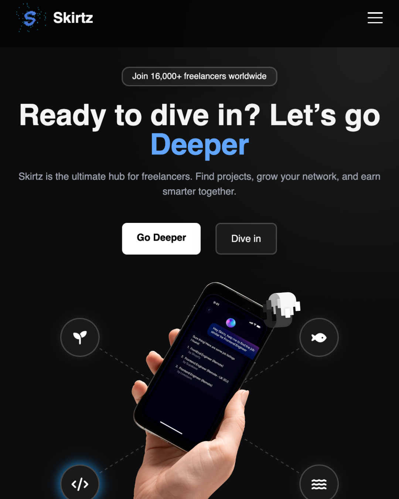

# 🌌 Sk*rtz – Freelancer Community Hub  

**Welcome to Sk*rtz**  
*Build. Connect. Earn Smarter.*  
*The Ultimate Hub for Freelancers.*  

Jadilah bagian dari komunitas freelancer global. Temukan proyek, kembangkan jaringan, dan raih peluang lebih baik bersama Sk*rtz.  

---

## 🖼️ Preview  

  

## 🎯 Tentang Sk*rtz  

Sk*rtz adalah platform komunitas freelancer modern yang didesain untuk mendukung pekerja lepas dalam:  
- Menemukan proyek yang sesuai  
- Memperluas jaringan profesional  
- Mengoptimalkan pendapatan secara cerdas  

Dengan tampilan interaktif dan teknologi web modern, Sk*rtz menjadi tempat berkumpulnya talenta digital dari berbagai bidang.  

---

## ✨ Kenapa Sk*rtz?  

- 🚀 **Project Marketplace** — Temukan pekerjaan sesuai keahlianmu  
- 🌍 **Community Network** — Bangun koneksi global dengan freelancer lain  
- 📊 **Smart Earnings** — Kelola pembayaran & progres kerja lebih mudah  
- 💡 **Resources & Insights** — Dapatkan tips, tools, dan strategi terbaru  
- 🔒 **Terbuka & Fleksibel** — Komunitas bebas berkembang sesuai kebutuhanmu  

---

### 📄 LICENSE  

```text
MIT License

Copyright (c) 2025 Sk*rtz

Permission is hereby granted, free of charge, to any person obtaining a copy
of this software and associated documentation files (the "Software"), to deal
in the Software without restriction, including without limitation the rights  
to use, copy, modify, merge, publish, distribute, sublicense, and/or sell  
copies of the Software, and to permit persons to whom the Software is  
furnished to do so, subject to the following conditions:  

The above copyright notice and this permission notice shall be included in all  
copies or substantial portions of the Software.  

THE SOFTWARE IS PROVIDED "AS IS", WITHOUT WARRANTY OF ANY KIND, EXPRESS OR  
IMPLIED, INCLUDING BUT NOT LIMITED TO THE WARRANTIES OF MERCHANTABILITY,  
FITNESS FOR A PARTICULAR PURPOSE AND NONINFRINGEMENT. IN NO EVENT SHALL THE  
AUTHORS OR COPYRIGHT HOLDERS BE LIABLE FOR ANY CLAIM, DAMAGES OR OTHER  
LIABILITY, WHETHER IN AN ACTION OF CONTRACT, TORT OR OTHERWISE, ARISING FROM,  
OUT OF OR IN CONNECTION WITH THE SOFTWARE OR THE USE OR OTHER DEALINGS IN THE  
SOFTWARE.
